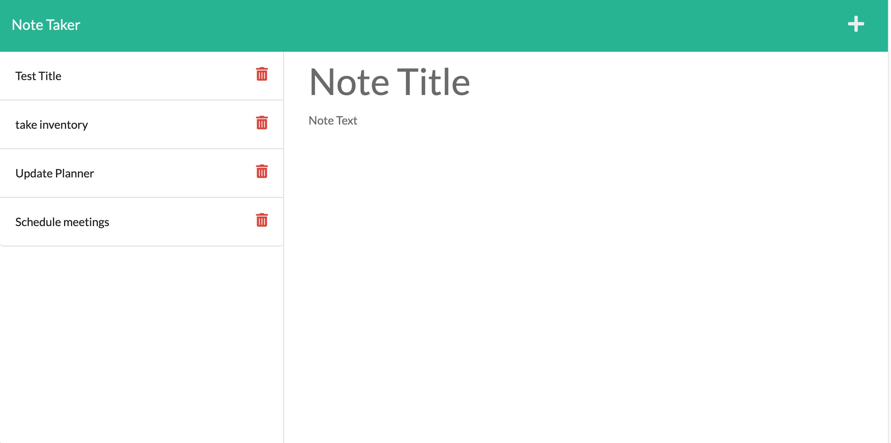

# Express.js-noteTaker

## Description

This app allows small business owners and other avid note-takers to organize their thoughts in a simple UI which allows for typing out notes and saving them for later viewing.

## Table of Contents

Refer to the explorer panel in the app in VS code to view file structure

### Installation

Be sure to run npm init to download dependencies

### Usage

See above

### License

MIT

### Contributors

Jake Lauterstein with help from tutor AB

### Tests

undefined

### Links

[github deployed app](https://jakelauterstein.github.io/express.js-noteTaker/)
[heroku deployed app](https://guarded-harbor-24280.herokuapp.com/notes)

### Questions

Should you have any questions/comments/concerns please reach out to the email listed below:

github profile: [https://github.com/jakelauterstein](https://github.com/jakelauterstein)
email address: [jakelauterstein@gmail.com](mailto:jakelauterstein@gmail.com)
